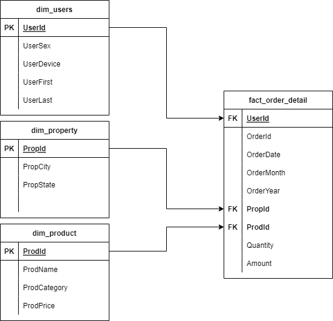

# DigitalSkola Mini Bootcamp 28 - 29 May 2022

## Day #1

Ingest Data from API with Json format and from csv files

for notebook demo, please check steps.ipynb file:
```c
https://github.com/armandzubir/DigitalSkola-MinibootCamp-2805022/blob/master/steps.ipynb
```

Tools used:
- Python
- VS Code
- https://app.diagrams.net
- Google Sheet
- Google Data Studio

Database Diagram

</img>

